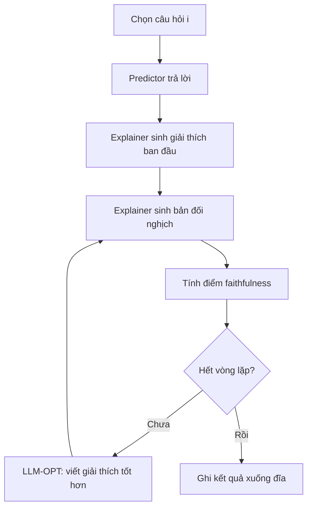
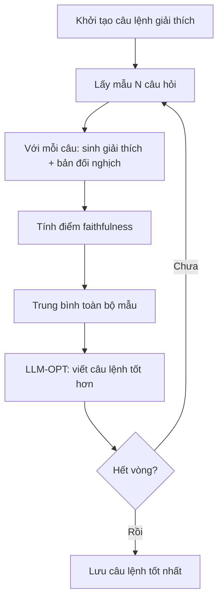
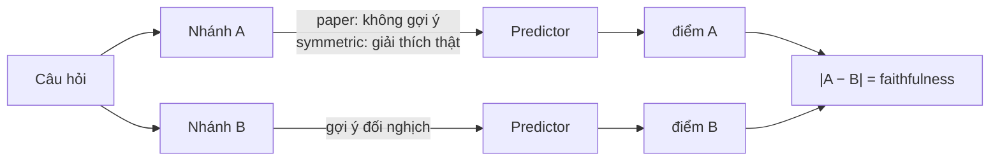

# FaithLM — Kiến trúc

> **Paper gốc**: *FaithLM: Towards Faithful Explanations for Large Language Models* (EACL 2026)

---

## 1. Ý tưởng

FaithLM đánh giá **độ trung thực** của giải thích do LLM sinh ra, bằng hai mô hình:

| Vai trò | Tên trong code | Nhiệm vụ |
|---|---|---|
| **Predictor** | `predictor` | Mô hình đích — trả lời câu hỏi; ta muốn giải thích hành vi của nó |
| **Explainer** | `explainer` | Mô hình riêng — sinh và cải thiện giải thích cho câu trả lời đó |

Giả thuyết: nếu giải thích **thật sự** phản ánh lý do predictor chọn đáp án, thì đưa vào một giải thích **đảo nghĩa** sẽ làm predictor đổi câu trả lời. Mức thay đổi đó chính là điểm faithfulness.

---

## 2. Cấu trúc mã nguồn

```
faithlm/
├── registry.py      # đăng ký thành phần theo tên
├── config.py        # config có kiểu, nạp từ YAML hoặc dict
├── datasets.py      # loader -> List[Example]
├── predictors.py    # mô hình đích + chấm điểm log-prob
├── explainers.py    # mô hình sinh giải thích + xử lý phản hồi
├── baselines.py     # baseline không dùng LLM
├── metrics.py       # chỉ số paper / symmetric
├── prompts.py       # toàn bộ mẫu prompt
├── pipelines.py     # vòng lặp local & global
└── run.py           # entrypoint dùng chung
```

Mọi thành phần chọn theo **tên** trong YAML, nên đổi mô hình không phải sửa code. Xem [configuration.md](configuration.md).

---

## 3. Hai chế độ

### 3.1 Local — tối ưu nội dung giải thích cho từng câu



### 3.2 Global — tìm một câu lệnh giải thích dùng chung



Khác biệt: **local** sửa *nội dung* giải thích cho từng câu; **global** sửa *câu lệnh* dùng chung cho mọi câu.

Cả hai đều ghi kết quả sau mỗi đơn vị công việc, nên bị ngắt giữa chừng vẫn chạy tiếp được.

---

## 4. Chỉ số faithfulness

Hai biến thể, chọn bằng `metric.name`:

### `paper` — tái lập bản gốc

```
|acc(không gợi ý) − acc(gợi ý đối nghịch)|
```

Đây là điều mã nguồn gốc **thực sự** làm. Lưu ý: giải thích thật được sinh ra nhưng không bao giờ được đưa vào predictor, nên chỉ số này lẫn giữa *tác động của việc có gợi ý* và *tác động của việc đảo nghĩa*.

### `symmetric` — bản sửa của chúng tôi

```
|acc(gợi ý = giải thích thật) − acc(gợi ý = giải thích đối nghịch)|
```

Cả hai nhánh đều có gợi ý, nên hiệu số chỉ phản ánh việc đảo nghĩa. Đây mới là điều phần mô tả của bài báo nói tới.



---

## 5. Cách chấm điểm

### `logprob` (mặc định)

Tính log-probability chuẩn hóa theo độ dài cho từng lựa chọn, rồi softmax để ra P(đáp án đúng).

Bản gốc so khớp chuỗi trên **một** câu hỏi nên điểm chỉ ra 0.0 hoặc 1.0, và hiệu số gần như luôn bằng 0 — LLM-OPT không có gì để tối ưu. Log-prob cho điểm liên tục chỉ với một forward pass, không tốn thêm thời gian.

Chỉ dùng được với dữ liệu có lựa chọn và predictor chạy cục bộ.

### `exact_match`

Giữ cách so khớp chuỗi của bản gốc, có thể lấy trung bình qua `k_samples` lần sinh. Dùng cho dữ liệu mở (TriviaQA) và predictor qua API.

---

## 6. LLM-OPT

Explainer đóng vai trò optimizer (theo hướng OPRO). Nó nhận danh sách các giải thích/câu lệnh trước đó kèm điểm số, và được yêu cầu viết bản mới có điểm cao hơn.

- Global: tối ưu **câu lệnh**, đánh dấu bằng `<INS>...</INS>`
- Local: tối ưu **nội dung giải thích**, đánh dấu bằng `<EXP>...</EXP>`

---

## 7. Định dạng kết quả

**Local** — `results/{variant}/local/sample-{idx}.json`:

```json
{
  "index": 0,
  "question": "###Question: What is the cause of the Premise?...",
  "gold_answer": "anh ấy về nhà",
  "model_answer": "anh ấy về nhà",
  "correct": true,
  "metric": "paper",
  "scorer": "logprob",
  "iterations": [
    {"step": 0, "score": 0.42, "true_arm": 0.85, "counter_arm": 0.43,
     "explanation": "...", "counterfactual": "..."}
  ],
  "best_score": 0.42,
  "best_explanation": "..."
}
```

**Global** — `results/{variant}/global/round-{n}.json` và `summary.json`.

Trường `true_arm` / `counter_arm` được giữ lại để phục vụ phân tích lỗi: một điểm thấp có thể do giải thích không trung thực, hoặc do cả hai nhánh đều bão hòa.
