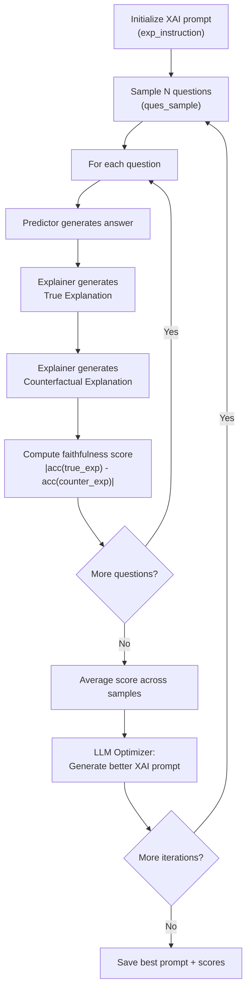
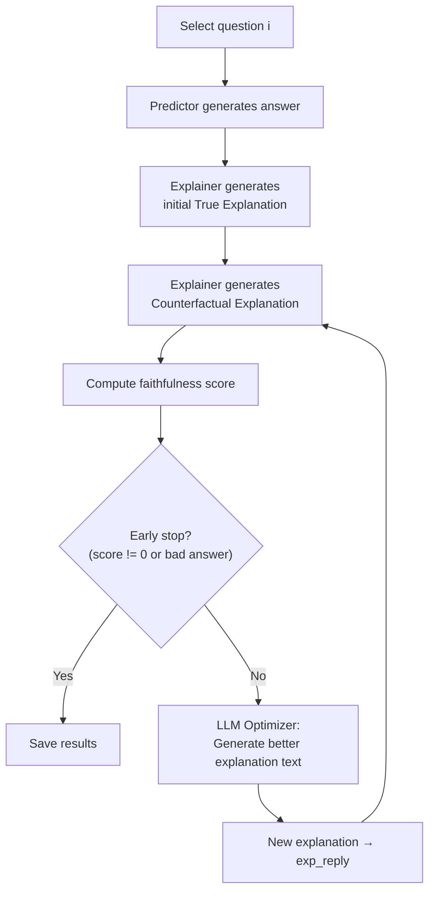
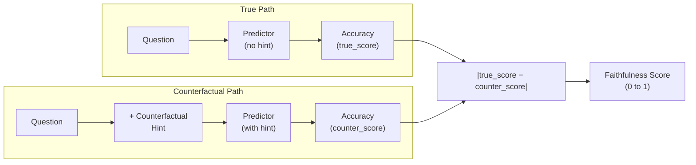

# FaithLM — Architecture & Pipeline

> **Paper**: *FaithLM: Towards Faithful Explanations for Large Language Models*
> **Venue**: EACL 2026 Long Paper
> **Repository**: [FaithLM](file:///home/long/Master/FaithLM)

---

## 1. High-Level Overview

FaithLM is a framework for generating **faithful explanations** of Large Language Model (LLM) predictions. It uses a two-model architecture:

| Role | Name in Code | Purpose |
|---|---|---|
| **Target LLM** (Predictor) | `pred_model` | The model whose behaviour we want to explain — it makes task predictions |
| **Explainer LLM** | `xai_model` | A separate model that generates and iteratively improves explanations of **why** the predictor answered the way it did |

The core idea: explanations are **faithful** if injecting the true explanation into the predictor preserves its answer, while injecting a counterfactual (opposite-meaning) explanation flips the answer. The gap between these two scores is the **faithfulness score**.

---

## 2. Repository Structure

```
FaithLM/
├── main_global.py          # Global explanation pipeline (prompt-level optimisation)
├── main_local.py           # Local explanation pipeline (instance-level optimisation)
├── model/
│   ├── predictor.py        # Target LLM loading, inference, and scoring
│   └── explainer.py        # Explainer LLM interface and prompt generation
├── results/                # Output directory (created at runtime)
└── README.md
```

---

## 3. Two Pipelines

FaithLM provides two complementary modes of explanation:

### 3.1 Global Explanations ([main_global.py](file:///home/long/Master/FaithLM/main_global.py))

**Goal**: Find a single, general-purpose **explanation prompt instruction** that, when used across many questions, produces the most faithful explanations.



**Key Parameters**:
- `xai_iter`: Number of optimisation iterations (default: 3)
- `round_xai_iter`: Number of optimisation rounds (default: 10)
- `ques_sample`: Questions sampled per iteration (default: 15)

### 3.2 Local Explanations ([main_local.py](file:///home/long/Master/FaithLM/main_local.py))

**Goal**: For each individual question, iteratively refine the **explanation text itself** to maximise faithfulness for that specific instance.



**Key Difference**: Local mode refines the explanation *content* per question; Global mode refines the explanation *prompt/instruction* across questions.

---

## 4. Module Details

### 4.1 Predictor Module ([predictor.py](file:///home/long/Master/FaithLM/model/predictor.py))

#### Model Loading — [`load_model()`](file:///home/long/Master/FaithLM/model/predictor.py#L10-L53)
Supports multiple backends:
- **Vicuna-7B** (`lmsys/vicuna-7b-v1.5`) — loaded via `LlamaForCausalLM`
- **Phi-2** (`microsoft/phi-2`) — loaded via `AutoModelForCausalLM`
- **Claude / GPT-3.5** — API-based (returns model name string, tokenizer = `None`)

#### Prediction Functions
| Function | Task | Prompt Template |
|---|---|---|
| [`generate_predictor_output_ecqa()`](file:///home/long/Master/FaithLM/model/predictor.py#L119-L191) | Multiple choice (ECQA, COPA, XCOPA) | `Instruction → Input (question + choices) → Response` |
| [`generate_predictor_output_trivaqa()`](file:///home/long/Master/FaithLM/model/predictor.py#L193-L221) | Open-ended QA (TriviaQA) | `Instruction → Context (passage) → Input (question) → Response` |
| [`generate_api_predictor_output()`](file:///home/long/Master/FaithLM/model/predictor.py#L55-L117) | API-based prediction (Claude/GPT) | Same template, sent via API |

#### Scoring Functions
| Function | Description |
|---|---|
| [`diff_task_score_ecqa()`](file:///home/long/Master/FaithLM/model/predictor.py#L355-L373) | Computes `|acc(true_exp) − acc(counter_exp)|` for choice tasks |
| [`diff_task_score_trivaqa()`](file:///home/long/Master/FaithLM/model/predictor.py#L446-L471) | Same metric for open-ended QA tasks |

The scoring works by:
1. Running the predictor **without** hint (true explanation baseline)
2. Running the predictor **with** the counterfactual explanation as a `### Hint`
3. Measuring the absolute accuracy difference → **faithfulness score**

### 4.2 Explainer Module ([explainer.py](file:///home/long/Master/FaithLM/model/explainer.py))

#### Response Generation — [`reponse_xai_model()`](file:///home/long/Master/FaithLM/model/explainer.py#L10-L65)
Dispatches to different backends based on `args.xai_model`:
- `"gpt35"` → Azure OpenAI API
- `"claude"` → Anthropic API (Claude-2)
- `"phi"` → Local Phi-2 model inference

#### Prompt Generators
| Function | Purpose |
|---|---|
| [`generate_exp_prompt()`](file:///home/long/Master/FaithLM/model/explainer.py#L67-L80) | Builds the prompt asking for an explanation of the predictor's answer |
| [`generate_counterfact_prompt()`](file:///home/long/Master/FaithLM/model/explainer.py#L162-L177) | Asks the explainer to generate a **counterfactual** (opposite meaning) of a given explanation |
| [`generate_global_xai_prompt()`](file:///home/long/Master/FaithLM/model/explainer.py#L82-L121) | LLM-OPT: asks the explainer to produce a *better* XAI instruction given past prompts and scores |
| [`generate_local_xai_prompt()`](file:///home/long/Master/FaithLM/model/explainer.py#L123-L160) | LLM-OPT: asks the explainer to produce a *better* explanation text given past explanations and scores |

---

## 5. Data Preprocessing

Each dataset is preprocessed into a `train_dict` with keys `question`, `answer` (and optionally `passage`):

| Dataset | Function | Source | Format |
|---|---|---|---|
| ECQA | `preprocess_ecqa()` | `yangdong/ecqa` | 5-choice QA |
| TriviaQA | `preprocess_trivaqa()` | `THUDM/LongBench` (triviaqa_e) | Passage + open QA |
| COPA | `preprocess_copa()` | `pkavumba/balanced-copa` | 2-choice causal reasoning |
| XCOPA | `preprocess_xcopa()` | `xcopa` (Italian in original code) | 2-choice cross-lingual causal reasoning |
| Social IQa | `preprocess_social()` | `tasksource/bigbench` (social_iqa) | Multi-choice social reasoning |

---

## 6. Faithfulness Scoring — The Core Metric



**Interpretation**:
- **High score (→ 1)**: The explanation meaningfully captured the predictor's reasoning — flipping it changed the predictor's answer.
- **Low score (→ 0)**: The explanation had no real connection to the predictor's decision process.

---

## 7. LLM-OPT (Optimization via LLM)

FaithLM uses the explainer LLM itself as an optimizer (inspired by OPRO — Optimization by PROmpting). The optimiser is given:

1. **Previous prompts/explanations** and their **scores**
2. **Task**: "Generate a new prompt/explanation that scores higher than all previous ones"

This creates a self-improving loop where the explainer iteratively refines either:
- The **instruction template** (global) — `<INS>...</INS>` delimited
- The **explanation text** (local) — `<EXP>...</EXP>` delimited

---

## 8. Prompt Templates

### Task Prompt (Predictor)
```
Below is an instruction that describes a task.
Write a response that appropriately completes the request of input.

### Instruction: {task_instruction}

### Input: {question + choices}

### Response: Let's think step by step.
```

### Explanation Prompt (Explainer)
```
{exp_instruction}

### Input: Q:{question}
A:{predictor_answer}
```

### Counterfactual Prompt
```
Please generate one example of obtaining the opposite meaning from given sentence.
Make sure you output sentences only.

Sentences: {explanation}
```

### LLM-OPT Prompt (Global)
```
Your task is to generate the instructions <INS> for providing model explanations.
Below are some previous instructions with their scores.
The score is calculated as the flipping answer rates and ranges from 0 to 1.

Instructions: {prompt_1}
Score: {score_1}
...

Generate an instruction that is different from all above and has a higher score.
The instructions should begin with <INS> and end with </INS>.
```

---

## 9. Output Format

Results are saved as JSON files:

**Global**: `global_{data}_{xai_model}_{pred_model}_iter-{N}_sample-{S}.json`
```json
[
  {"Score": 0.4, "XAI prompt": "..."},
  {"Score": 0.6, "XAI prompt": "..."},
  {"Score": "Final", "XAI prompt": "..."}
]
```

**Local**: `local_{data}_{xai_model}_{pred_model}_iter-{N}_sample-{idx}.json`
```
============ Correct --> Q:... || GT-A:... || LLM-A:...
{'Score': 0.0, 'XAI prompt': '...'}
{'Score': 1.0, 'XAI prompt': '...'}
```
